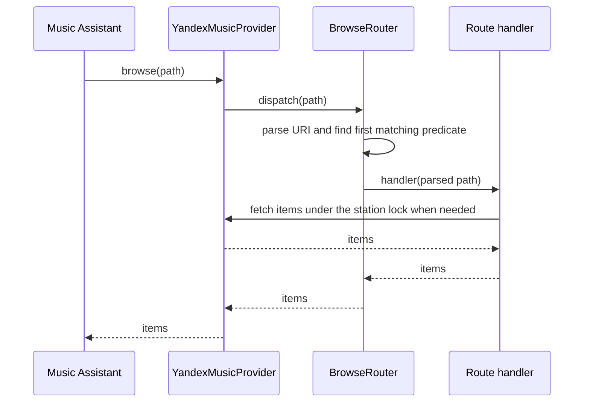

## Problem Statement

The provider's browse entry point mixes URI dispatch, wave-mode and saved-preset
parsing, library delegation, tag discovery and root-folder construction in a
large method with `PLR0911` and `PLR0915` suppressions. Adding a route requires
reviewing unrelated branches, while individual handlers cannot be tested apart
from that dispatch chain.

## Solution Summary

Move dispatch and URI handling into a private `_BrowseRouter` in a separate
browse module. It owns an ordered registry of pure predicates and asynchronous
handlers; the first match wins. The provider creates one router lazily on first
browse and retains it for subsequent calls. Provider API retrieval methods remain
bound to the provider. Root construction and wave/preset URI handling belong to
the router. Wave operations keep the per-station lock, including assignment of
saved settings. MA's library fallback is retained for standard library folders
and unknown non-root paths, including its existing `KeyError` behavior.

## Acceptance Criteria

1. The provider's browse entry point only checks browse support, obtains its
   router and delegates the URI. It contains no subpath-specific dispatch.
2. Existing root, collection, pins, history and My Wave tests pass unchanged.
3. Router checks cover first-match precedence, direct invocation of a handler,
   known-folder dispatch, root browsing and the existing unknown-path fallback.
4. Both slash and underscore forms of wave modes and saved presets retain
   their pagination flags, validation and per-station locks.
5. Adding a route requires editing the router registry and handler only; the
   provider's browse entry point remains unchanged.
6. The browse lint suppressions are removed, no type ignores are introduced,
   and the full tests, mypy and pre-commit checks pass.

## Test Plan

- `tests/test_browse_router.py`: registry precedence, handler isolation,
  library delegation, tag discovery, direct stations, URI forms, invalid
  presets and wave locks.
- Existing `tests/test_my_wave.py`, `tests/test_browse_collection.py` and
  `tests/test_browse_pins_history.py`: retain all existing expectations.
- Full provider test suite, Ruff, mypy and pre-commit.
- Manual acceptance before release: navigate My Wave, wave modes, saved
  presets, collection, recommendations, radio, pins and history in MA.

## Sequence Diagram

## Data Model

- `_BrowsePath`: immutable request object containing the full URI, its path
  components, subpath and sub-subpath. Parsing retains empty segments.
- `_BrowseRoute`: immutable pair of a pure predicate and an asynchronous handler.
- `_BrowseRouter`: provider reference and ordered route tuple; an optional
  registry override supports isolated dispatch checks.
- The provider retains the router per instance. No persisted state changes;
  station sessions, presets and locks use the existing wave-state objects.
