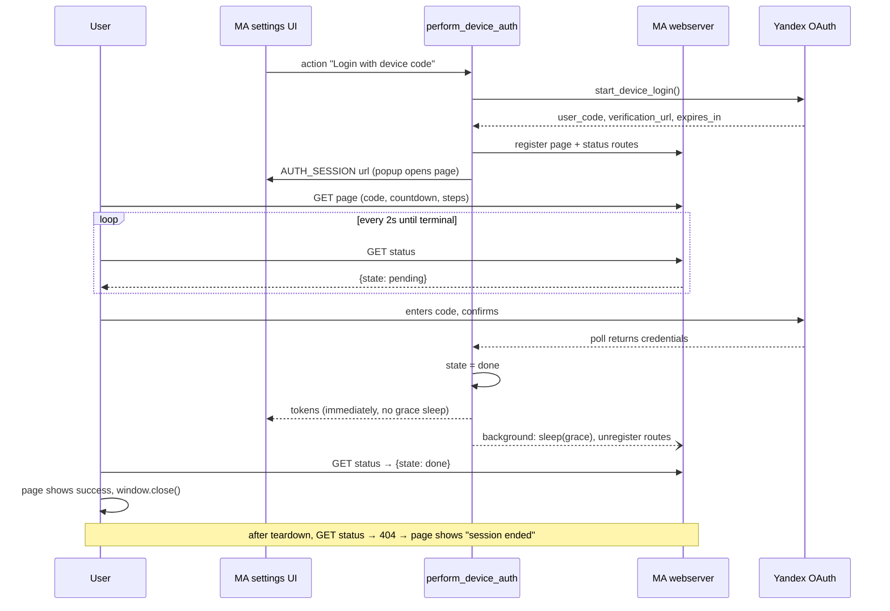

## Problem Statement

The intermediate page shown during "Login with device code" has several
user-observable defects:

- After the user confirms the code on Yandex, the Music Assistant settings
  dialog stays frozen for ~3 seconds (a fixed grace delay runs before the
  flow returns) — on failures the error is delayed the same way.
- The "Copy code" button is broken in the most common deployment: MA is
  served over plain HTTP on a LAN, where the browser Clipboard API is
  unavailable, so the button always falls back to "Press Ctrl/Cmd+C" —
  a dead end on phones and tablets.
- The copy affordance is not obvious: the large code looks inert, while
  the actual copy control is the smallest element on the page.
- The page gives no hint that the code expires; when it does, the user
  sees only a generic "Authorization failed" long after the fact.
- If the popup outlives the login session (e.g. it never closed), the page
  keeps polling a dead endpoint forever and still shows "enter the code".
- All failures show the same message — an expired code and a rejected
  login require different user actions.
- The page is English-only and light-only, while the provider's audience
  is largely Russian-speaking and MA is commonly used in dark theme.
- The verification URL is hidden behind a button, so a user who wants to
  type it on another device (phone) cannot see it.

## Solution Summary

Rework the device-code flow around instant feedback and an obvious
single-step copy: the login flow returns to MA as soon as the outcome is
known (route teardown happens in the background), the status endpoint
reports *why* a login failed, and the page is rebuilt as a numbered
two-step card — a click-to-copy code (with an `execCommand` fallback that
works over plain HTTP) and a visible verification URL — with a countdown
timer, terminal states for expiry/session-end, Russian/English
localization picked from the MA locale, and dark-theme support.

## Acceptance Criteria

1. `perform_device_auth` returns (or raises) without any post-auth grace
   delay in the caller's path; the intermediate page's routes are torn
   down in a background task after a grace period, and both routes are
   always eventually unregistered — on success, failure, and cancellation.
2. The status endpoint reports `{"state": "failed", "reason": "expired"}`
   for a timed-out code, `reason: "denied"` for a rejected login, and
   `reason: "error"` for any other failure; success stays
   `{"state": "done"}` and in-progress stays `{"state": "pending"}`.
3. The page copies the code when the user clicks/taps the code block
   itself: it tries `navigator.clipboard` first and falls back to
   selection + `document.execCommand("copy")` so copying works on plain
   HTTP; the block visually signals both the affordance (pointer cursor,
   copy hint) and success feedback. The separate "Copy code" button is
   removed.
4. The page shows the verification URL as visible text (not only as a
   button link) and presents the flow as two numbered steps.
5. The page shows a countdown derived from the server-provided
   `expires_in`; when it reaches zero the page switches to an "expired"
   state and stops polling. When the status endpoint disappears (HTTP
   404 after teardown) the page shows a terminal "session ended" state
   instead of polling forever.
6. Page copy (title, instructions, buttons, terminal states) renders in
   Russian when the MA locale starts with `ru`, English otherwise, and
   the page adapts to `prefers-color-scheme: dark`.
7. After a successful login action, the MA settings label makes the
   required "Save" step explicit and prominent.

## Test Plan

- `test_perform_device_auth_returns_without_grace_delay` — success path
  finishes with zero `asyncio.sleep` awaits in the caller's path;
  teardown happens via a scheduled background task.
- `test_perform_device_auth_teardown_runs_in_background` — after the
  coroutine returns and the event loop drains, both dynamic routes are
  unregistered (success, failure, and cancellation variants).
- `test_perform_device_auth_status_reports_failure_reason` — parametrized:
  `DeviceCodeTimeoutError → expired`, `InvalidCredentialsError → denied`,
  other `YaPassportError → error`.
- `test_device_code_page_copy_targets_code_block` — HTML contains a click
  handler on the code block, an `execCommand` fallback, and no standalone
  copy button.
- `test_device_code_page_shows_countdown_and_terminal_states` — HTML embeds
  the session `expires_in` value and handles 404 as a terminal state.
- `test_device_code_page_shows_verification_url_as_text` — the URL appears
  as visible text in addition to the link `href`.
- `test_device_code_page_localized_russian` / `..._defaults_to_english` —
  locale `ru_RU` renders Russian strings; anything else (including a
  non-string locale) renders English.
- `test_device_code_page_supports_dark_theme` — HTML contains a
  `prefers-color-scheme: dark` block.
- `test_get_config_entries_label_prompts_save_after_auth` — after a device
  auth action the status label contains an explicit Save warning.
- Manual verification: run MA via `docker-compose.dev.yml`, perform a real
  device-code login over plain HTTP from a phone browser, verify tap-to-copy,
  countdown, dark theme, and instant dialog feedback.

## Sequence Diagram

## Data Model

Status endpoint JSON payload (served while the login session is alive):

| Field | Type | Change | Values |
|-------|------|--------|--------|
| `state` | string | existing | `pending` \| `done` \| `failed` |
| `reason` | string | **new**, only when `state=failed` | `expired` \| `denied` \| `error` |

Page template inputs (server-side render):

| Input | Type | Change | Notes |
|-------|------|--------|-------|
| `user_code` | string | existing | HTML-escaped |
| `verification_url` | string | existing | now also rendered as visible text |
| `status_url` | string | existing | JSON-escaped into inline script |
| `expires_in` | int | **new** | seconds until the code expires; drives countdown |
| `language` | string | **new** | `ru` \| `en`, derived from `mass.metadata.locale` |

No changes to stored config values or provider models.
