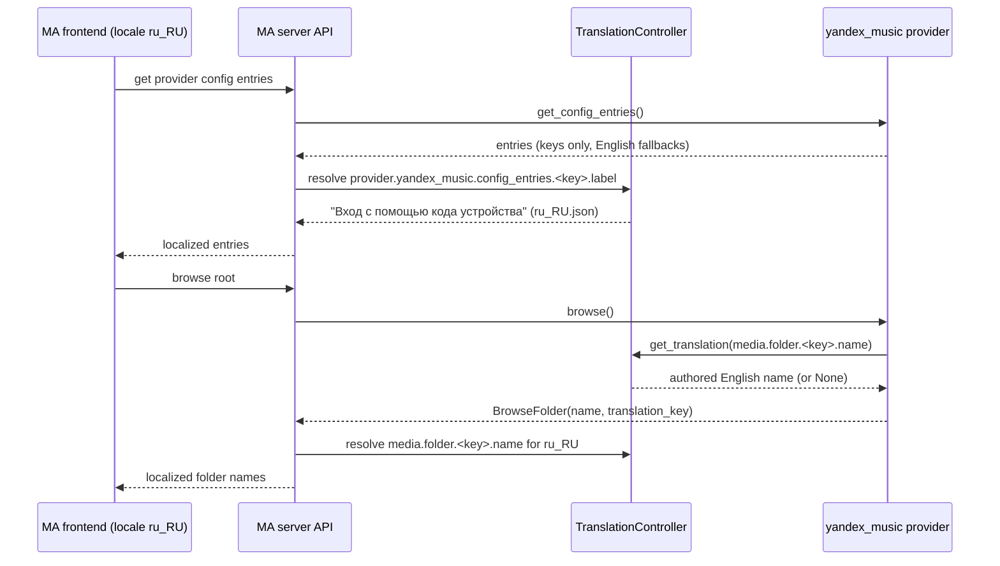

## Problem Statement

Upstream Music Assistant introduced a server-side localization pipeline in
June 2026 (`strings.json` per provider → Lokalise → 31 locale catalogs,
resolved at API serialization) and migrated the inlined `yandex_music`
copy to it — including 208 Russian translations already live in
`ru_RU.json`. This repository, the source of truth for the provider, still
carries the pre-migration state:

- Settings labels/descriptions are hardcoded English strings in code; the
  MA settings UI shows them untranslated regardless of the user's locale.
- Browse folder names are locale-switched at build time via hardcoded
  RU/EN dictionaries — only two languages, invisible to Lokalise.
- `ConfigValueOption` is constructed with the legacy `(title, value)`
  positional order; against current `music-assistant-models` (≥1.1.15x,
  order `(value, title)`) the stored value and the display title are
  silently swapped for quality options and wave-preset dropdowns.
- Any future sync of this repo's provider to upstream would revert the
  upstream localization migration and fail upstream's new CI guards
  (`check_config_entries.py`, `check_translatable_labels.py`), which
  forbid hardcoded user-facing strings.

## Solution Summary

Reverse-sync the upstream localization state on top of this repo's newer
code (3-way merge from the shared 3.5.15 base): ship `strings.json` as the
single English source for config entries / categories / media names /
manifest description; drop hardcoded labels, descriptions and the RU/EN
browse dictionaries from code; put `translation_key` on browse and
recommendation folders with English fallbacks, resolving authored names
via the MA translations controller; adopt the new `ConfigValueOption`
signature; carry over upstream's accompanying sweeps to the inlined copy
so the trees converge. Strings added by this repo after the upstream
snapshot (the post-login Save warning from spec 0002) are authored into
`strings.json` as new keys.

## Acceptance Criteria

1. `provider/strings.json` exists, is valid JSON, and defines a
   `config_entries.<key>` block (at least `label`) for every ConfigEntry
   key returned by `get_config_entries` that carries user-facing text,
   plus `media` and `manifest.description` sections — matching upstream's
   authored keys.
2. No ConfigEntry in `get_config_entries` hardcodes a user-facing
   `label` / `description` / `action_label` (the dynamic status label is
   the single documented exception, as upstream keeps it).
3. Every option of the quality selector and wave-preset dropdowns is
   constructed with the current models signature — the option's `value`
   equals the stored config constant (e.g. `QUALITY_BALANCED`), never the
   display title.
4. Browse and recommendation folders carry a `translation_key` with an
   English `name` fallback; the RU/EN browse-name dictionaries and their
   locale switch are gone from the code.
5. Folder names authored in `strings.json` resolve through the MA
   translations controller (`mass.translations.get_translation`); an
   unauthored key (e.g. a Yandex-discovered tag) keeps its already
   localized name verbatim with no translation key.
6. The post-login "click Save" warning from spec 0002 is authored in
   `strings.json` (new key) rather than hardcoded.
7. Full test suite and `pre-commit run --all-files` pass against current
   `music-assistant@dev` / models ≥ 1.1.154.

## Test Plan

- `test_strings_json_covers_config_entries` — every user-facing config
  entry key appears in `strings.json` `config_entries` with a `label`;
  parse errors fail loudly.
- `test_config_entries_have_no_hardcoded_labels` — entries returned by
  `get_config_entries` carry no literal `label`/`description` text
  (allowlist: the dynamic status label).
- `test_quality_options_use_value_first_signature` — quality option
  `value`s equal the `QUALITY_*` constants (red against current swapped
  construction).
- `test_browse_folders_carry_translation_keys` — root browse listing
  yields folders whose `translation_key`s are all authored under
  `media.folder` in `strings.json`.
- `test_media_label_falls_back_verbatim` — unauthored key returns the
  fallback name and `translation_key=None`.
- Existing suite (378 tests) stays green — regression net for the merged
  upstream sweeps.
- Manual verification: docker dev environment with a fresh MA nightly,
  UI language Russian — settings entries and browse folders render in
  Russian from `ru_RU.json`.

## Sequence Diagram

## Data Model

`provider/strings.json` (new file, English source; nested JSON):

| Section | Keys | Notes |
|---------|------|-------|
| `config_entries.<key>` | `label`, `description?`, `action_label?`, `options?` | `<key>` = ConfigEntry key; shared strings via `[%key:common::...%]` refs |
| `config_categories.<cat>` | string | category headers |
| `media.folder.<slug>.name` | string | browse folder names (slug = folder ID constant) |
| `media.playlist.<slug>.name` | string | virtual playlists (My Wave, Liked Tracks) |
| `media.recommendations.<slug>.name` | string | recommendation folders |
| `manifest.description` | string | provider description |

Code-side changes: `ConfigEntry` loses literal `label`/`description`
(fields become translation-resolved); `ConfigValueOption(value, title?)`
new positional order; `BrowseFolder`/`RecommendationFolder` gain
`translation_key`; `BROWSE_NAMES_RU`/`BROWSE_NAMES_EN` and
`PROVIDER_DISPLAY_NAME_RU/EN` deleted from `constants.py`.
