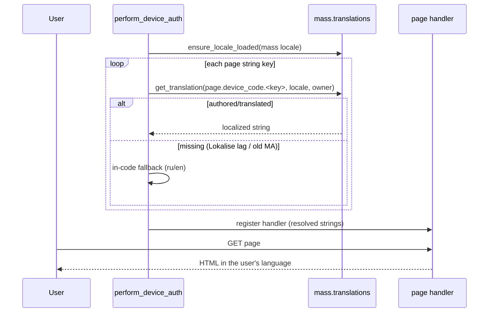

## Problem Statement

The device-code login page carries its own two-language string table
(English + Russian) inside the auth code. Users running Music Assistant
in any of the other 29 supported locales see the page in English even
though MA's translation pipeline (strings.json → Lokalise) could serve
their language; translators never see these strings; and the Russian
copy lives in code instead of the shared translation catalog, so it can
drift from the terminology used across the rest of the provider's
(already localized) settings.

## Solution Summary

Author the device-code page strings in `strings.json` under a dedicated
`page.device_code` section (the translations build flattens arbitrary
sections into `provider.yandex_music.page.device_code.*`). At login
time the provider resolves each string for the MA locale through the
translations controller, falling back to the in-code English/Russian
table when a key is not yet translated (Lokalise lag) or when the MA
build predates the controller. The page template consumes the resolved
strings; behaviour is otherwise unchanged.

## Acceptance Criteria

1. `strings.json` defines `page.device_code.<key>` for every
   user-visible page string (all keys of the in-code table except the
   HTML `lang` attribute).
2. During `perform_device_auth` the page strings are resolved through
   `mass.translations.get_translation` for the active MA locale, after
   ensuring that locale's catalog is loaded.
3. A key the controller cannot resolve falls back to the in-code table
   in the page language (Russian for `ru*` locales, English otherwise).
4. On an MA build without the translations controller the page renders
   exactly as today (in-code table, no errors).
5. A translated value returned by the controller appears verbatim in
   the served page HTML (integration through the real page handler).
6. Full suite and `pre-commit run --all-files` stay green.

## Test Plan

- `test_strings_json_authors_device_page_keys` — parity between
  `page.device_code` keys in strings.json and the in-code English table
  (minus `lang`).
- `test_page_strings_resolve_through_translations` — controller returns
  a marker value → marker lands in the rendered page HTML.
- `test_page_strings_fall_back_when_unresolved` — controller returns
  None → Russian/English in-code strings by locale (both cases).
- `test_page_strings_survive_missing_controller` — `mass` without a
  `translations` attribute renders the current page unchanged.
- Manual: docker dev environment, MA locale ru_RU — page renders in
  Russian (fallback path today, catalog path once Lokalise ships keys).

## Sequence Diagram

