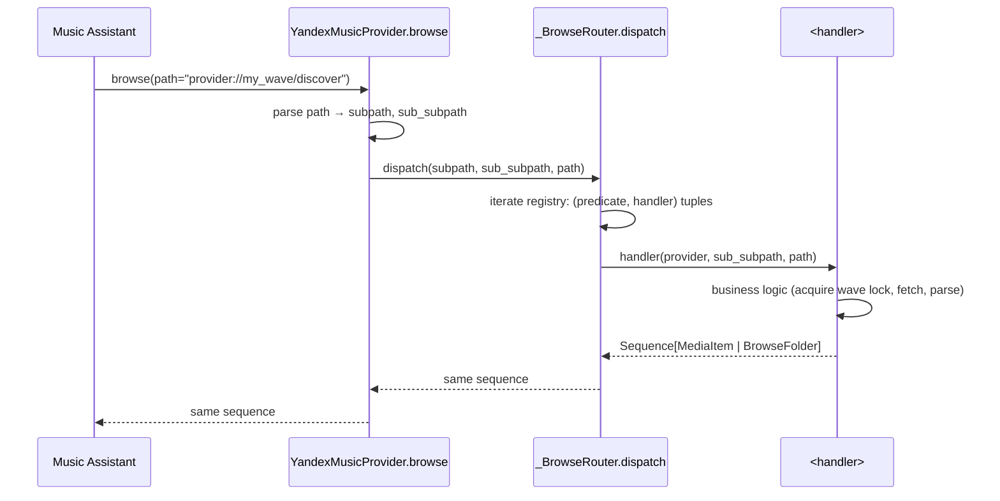

## Problem Statement

The `browse()` entry point on the Yandex Music provider is the single
function that resolves every URL the Music Assistant frontend sends — from
`provider://` (root) through `provider://my_wave` and
`provider://waves/genre/<tag>` down to the seasonal-mix variants. It
dispatches with a chain of ~24 `if`/`elif` branches over `subpath` and
`sub_subpath`, currently guarded by `# noqa: PLR0911, PLR0915` to silence
"too many return statements" and "too many statements" lints.

Externally there is no user-visible bug — the routing works. The problem
is internal:

- A new browse path requires a contributor to read the whole `browse()`
  body to find a safe insertion point that does not change ordering
  semantics for an existing branch.
- A change to a single handler (e.g. wave-modes UI) cannot be regression-
  tested in isolation — every browse test exercises the full dispatch
  chain.
- The function is 200+ lines, so review attention frays before the bottom
  branches and bugs accumulate there.

The provider is also targeted for inlining into
`music_assistant/providers/yandex_music` upstream eventually. The current
shape carries lint suppression and god-function smell into that future
import. Extracting now keeps the upstream PR clean.

## Solution Summary

Replace the long `if/elif` chain in `YandexMusicProvider.browse()` with a
registry of `(predicate, handler)` pairs owned by a private
`_BrowseRouter` class. Each handler is an `async` method on the router
(or a callable bound to the provider) that owns one URL prefix. `browse()`
becomes: parse the path, iterate the registry, invoke the first matching
handler, return its result.

The registry is constructed once per provider instance and shared with
the existing `_get_wave_state` lock convention so wave-mode browse still
runs under the wave-session lock when needed. No URL contracts change;
existing browse tests pass without modification (or with mechanical
imports-only edits). The `# noqa: PLR0911, PLR0915` on `browse()` can be
removed because each handler is small enough to satisfy the lint
thresholds individually.

The refactor is internal-only: MA's `browse(path)` contract, the URL
namespace, and the returned `Sequence[MediaItemType | ItemMapping |
BrowseFolder]` shape are all preserved bit-for-bit.

## Acceptance Criteria

1. `YandexMusicProvider.browse()` contains zero `if path.startswith(...)`
   or `if subpath == ...` branches — dispatch is fully delegated to the
   `_BrowseRouter`.
2. Every existing browse test in `tests/test_browse_collection.py` and
   `tests/test_browse_pins_history.py` (and any future
   `tests/test_browse_*.py`) passes with at most trivial import changes.
3. New unit tests in `tests/test_browse_router.py` exercise the router
   in isolation: registration order is honoured (first match wins),
   unknown paths return root (or an explicit `NotFound` per current
   behaviour), and each handler is invocable without going through
   `browse()`.
4. Adding a new browse path under `my_waves_set/...` does not require
   editing `provider.py` — only adding a new `(predicate, handler)`
   tuple to the registry.
5. `# noqa: PLR0911, PLR0915` is removed from `browse()` and mypy strict
   passes without any new `type: ignore` comments.
6. `pre-commit run --all-files` is green; `uv run pytest` reports the
   same number of passing tests as before (plus the new router tests).

## Test Plan

- `tests/test_browse_router.py::test_registry_dispatches_first_match` —
  pin first-match wins when two predicates would accept the same path.
- `tests/test_browse_router.py::test_unknown_path_falls_through_to_root` —
  pin the root-fallback contract.
- `tests/test_browse_router.py::test_handler_invokable_in_isolation` —
  call a single handler directly with a fake provider stub; assert it
  returns the same shape `browse()` would.
- `tests/test_browse_collection.py` — existing tests must pass.
- `tests/test_browse_pins_history.py` — existing tests must pass.
- `tests/test_my_wave.py` (browse paths) — existing tests must pass.
- Manual: run a local MA instance with this provider, navigate root →
  My Wave → wave-modes → preset; navigate root → Radio → genre → tag;
  navigate root → For You → Top Picks. All should resolve identically
  to current behaviour.

## Sequence Diagram



## Data Model

`_BrowseRouter` is a private class on `provider.py`:

```python
@dataclass(frozen=True)
class _BrowseRoute:
    """One entry in the browse registry."""

    # Match function. Receives parsed subpath + sub_subpath; returns True
    # when this handler should run. Keep predicates pure: no I/O, no
    # awaits.
    matches: Callable[[str | None, str | None], bool]
    # Async handler. Receives provider, the path tuple, and the original
    # raw path (for handlers that need it for logging or for handing back
    # to MA as a ``BrowseFolder.path``).
    handler: Callable[
        ["YandexMusicProvider", str | None, str | None, str],
        Awaitable[Sequence[MediaItemType | ItemMapping | BrowseFolder]],
    ]


class _BrowseRouter:
    """Dispatch ``browse()`` paths to per-prefix handlers."""

    def __init__(self, routes: Sequence[_BrowseRoute]) -> None:
        self._routes = list(routes)

    async def dispatch(
        self,
        provider: "YandexMusicProvider",
        subpath: str | None,
        sub_subpath: str | None,
        full_path: str,
    ) -> Sequence[MediaItemType | ItemMapping | BrowseFolder]:
        for route in self._routes:
            if route.matches(subpath, sub_subpath):
                return await route.handler(provider, subpath, sub_subpath, full_path)
        # Fall through: same root-listing the current chain emits when no
        # branch matches.
        return await provider._browse_root(full_path)
```

The provider builds the router once in `handle_async_init`:

```python
self._browse_router = _BrowseRouter(
    [
        _BrowseRoute(
            matches=lambda sp, ssp: sp == MY_WAVE_PLAYLIST_ID,
            handler=_handle_my_wave,
        ),
        _BrowseRoute(
            matches=_matches_wave_mode,  # both slash + underscore URL forms
            handler=_handle_wave_mode,
        ),
        # ... ~20 more entries, one per existing if/elif branch
    ]
)
```

Each existing `_browse_*` method on the provider becomes a free function
or a bound `_BrowseRoute.handler`. No method bodies need to change
beyond signature normalisation (every handler receives the same four
arguments).

No persisted state changes. No upstream MA contract changes.

## Out of scope

- The proposed `_RecommendationsManager` extraction (`recommendations()`
  + 9 sub-methods) — a separate spec if it lands at all.
- Renaming or restructuring URL prefixes — every existing path resolves
  to the same handler.
- Removing the wave-session lock from `_handle_my_wave` — locking
  remains where it is; only the dispatch shell moves.
